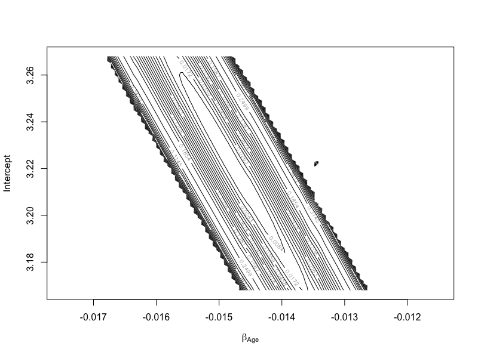

KMC
===

The Kaplan-Meier estimator is very popular in analysis of survival data. However, it is not easy to compute the *constrained* Kaplan-Meier. Current computational method uses the expectation maximization (EM) algorithm to achieve this, but can be slow at many situations. In this package we give a recursive computational algorithm for the *constrained* Kaplan-Meier estimator. The constraint is assumed given in **linear** estimating equations or **mean functions**. 


We also illustrate how this leads to the empirical likelihood ratio test with right censored data and apply it to test non-parametric [AFT](http://www.ms.uky.edu/~mai/research/BJ2.pdf) problem. The proposed has a significant speed advantage over EM algorithm.

This package is written and maintained by Yifan Yang (<mailto:yifan.yang@uky.edu>), and co-authored by Dr Zhou (<http://www.ms.uky.edu/~mai/>). The package is released on CRAN (http://cran.r-project.org/web/packages/kmc/). 


Installation
============
One can install the development version using

```r
library(devtools); 
install_github('kmc', 'yfyang86');
```

Examples
=========

One/two constraints
------------

Run the following code in R with only one null hypothesis $E[X]=\int x d F(x) = 3.7.$ :

```r
library(kmc)
x <- c(1, 1.5, 2, 3, 4.2, 5, 6.1, 5.3, 4.5, 0.9, 2.1, 4.3)
d <- c(1, 1, 0, 1, 0, 1, 1, 1, 1, 0, 0, 1)
f <- function(x) {
    x - 3.7
}
g = list(f = f)
result = kmc.solve(x, d, g)
print(result)
---------------------------------------------------------------------------------
A Recursive Formula for the Kaplan-Meier Estimator with Constraint
Information:
Number of Constraints:	 1
lamda(s):	 -1.439612

---------------------------------------------------------------------------------
     Log-likelihood(Ha)  Log-likelihood(H0)  -2LLR     p-Value(df=1)
Est  -17.5198            -17.8273              0.6150    0.4329
---------------------------------------------------------------------------------

```

If we add another constraint: $E[X^2]=16.5$, then 

```r
> myfun5 <- function(x) {
+     x^2 - 16.5
+ }
> # construnct g as a LIST!
>
> g = list(f1 = f, f2 = myfun5)
> re0 <- kmc.solve(x, d, g)
> re0

---------------------------------------------------------------------------------
A Recursive Formula for the Kaplan-Meier Estimator with Constraint
Information:
Number of Constraints:	 2
lamda(s):	 -0.4148702 -0.1546575

---------------------------------------------------------------------------------
     Log-likelihood(Ha)  Log-likelihood(H0)  -2LLR     p-Value(df=2)
Est  -17.5198            -17.8345              0.6293    0.7301
---------------------------------------------------------------------------------
```


Contour Plot
--------------
If there were two constraints, we could plot a contour plot for the log-likelihood. Typically, $30 \times 30$ data points, are used to draw the contour plot, which means the computation repeats 900 times.

```r
ZZ <- plotkmc2D(re0)
```

This package offers a naive contour plot. One can use `ZZ` to draw contour plot with the help of `ggplot2`.


A careful tuning version is 

```r
#!/usr/local/bin/Rscript
# file: TESTKMC.R
args <- commandArgs(TRUE)

t1=as.numeric(args[1])
t2=as.numeric(args[2])

library(kmc)
x <- c(1, 1.5, 2, 3, 4.2, 5, 6.1, 5.3, 4.5, 0.9, 2.1, 4.3)
d <- c(1, 1, 0, 1, 0, 1, 1, 1, 1, 0, 0, 1)
f_1 <- function(x) {x - t1}

f_2 <- function(x) {x^2-t2}
g <- list(f1=f_1,f2=f_2);

re0 <- kmc.solve(x, d, g)

ZZ <-  plotkmc2D(re0,range0 = c(0.1, .4, 30))
```


This version uses a 30 by 30 grid to construct the contour plot on a iMac2007 2.0Hz Core2 machine and only spend (2s to load R): 

```sh
time Rscript TESTKMC.R 4.0 18.6
real0m20.202s
user0m18.817s
sys0m0.240s
```
Real Data Example
--------------------------
The speed advantage of KMC algorithm could be used in time consuming analysis such as drawing contour plot. In this real data example, we illustrate the proposed algorithm to analyze the Stanford heart transplants program described in (Miller 1982). There were 157 patients who received transplants collected in the data, among which 55 were still alive and 102 were deceased. Besides, the survival time were scaled by 365.25. We could draw a contour plot of intercept and slope for a AFT model.

```r
library(survival)

LL= 50
beta0 <- 3.218
beta1 <- -0.0145

stanford5 <- stanford2[!is.na(stanford2$t5), ]

beta.grid <- function(x0,range,n0,type="sq",u=5){
	n0 = as.double(n0)
	if (type=="sq"){
		o1 <- c(
		-range*(u*(n0:1)^2)/(u*n0^2),0,
		range*(u*(1:n0)^2)/(u*n0^2)
		)
	}else{
	if (type=='sqrt'){
		o1 <- c(
		-range*(u*sqrt(n0:1))/(u*sqrt(n0)),0,
		range*(u*sqrt(1:n0))/(u*sqrt(n0)))
		}else{
		o1=c(
		-range*(n0:1)/n0,
		0,
		range*(1:n0)/n0
		)
		}  
	}
	return(
		x0+o1
		);
}

beta.0 <- beta.grid(beta0, 0.05, LL,"l")
beta.1 <- beta.grid(beta1,.003,LL,"l")

set.seed(1234)

y=log10(stanford5$time)+runif(157)/1000

d <- stanford5$status

oy = order(y,-d)
d=d[oy]
y=y[oy]
x=cbind(1,stanford5$age)[oy,]

ZZ=matrix(0,2*LL+1,2*LL+1)

library(kmc)
tic=0
for(jj in 1:(2*LL+1)){
for(ii in 1:(2*LL+1)){
  beta=c(beta.0[ii],beta.1[jj])
  ZZ[jj,ii]=kmc.bjtest(y,d,x=x,beta=beta,init.st="naive")$"-2LLR"
}
}
ZZ2<-ZZ
ZZ[ZZ<0]=NA ## when KMC.BJTEST fails to converge, it'll return a negative value.
ZZ[ZZ>0.5]=NA

range(ZZ,finite=T) -> zlim
floor.d<-function(x,n=4){floor(x*10^n)/(10^n)}

contour(
  y=beta.0,
  x=beta.1,
  ZZ,
  zlim=c(0,1),
  levels=unique(floor.d(
		beta.grid(x0=mean(zlim),range=diff(zlim)/2, n0=15,type="sqrt",u=10),
		4)),
  ylab="Intercept",
  xlab=expression(beta[Age])
  ) 

```

The countour plot is 



Another one concentrates on two hypothesizes on survival function are considered: $H_0^{(1)}: ~ Mean=\int x d F(x)=\mu ; ~ H_0^{(2)}: ~ F(3)=\int I(x\leq 3) d F(x)=\nu$.


Here, $30\times 30$ combinations of $(\mu,\nu)$ near NPMLE($0.5569$,$3.061$), i.e. value plugged in with Kaplan Meier estimation, were used to construct a contour plot of the constrained log empirical likelihood. On the same computer, the program finished in 17 seconds.  EM based method could also reproduce the same plot, but the time spend is not evaluated as some values fails to converge within 2 minutes.


Initial value
-------------
There are known issues on some scenario when dealing with more than one constraint. According to our simulation, automatic tuning strategy fails under some constraints. One can always use proper initial values, and I will add additional strategies in future work.

In current developing version, this package depends on `rootSolve::multiroot`, which provides a lot of options. 

Changelog
------------

- [x] Bug fix:  rootSolve issue [LINK](https://github.com/yfyang86/kmc/issues/5)
- [x] Buckley James: Add a `converge` tag to indicate the convergence.
- [x] Add two uni-tests on `kmc.solve` and `kmc.bjtest`.

TODO
------------

- When the initial `lambda` is not good, the optimization fails. One may notice there is a negative "LLR" consequently. This is due to the `root solve` process fails to identify the right branch to search `lambda` (p>1 dimensions). Currently, hidden functions `kmc_routine5_1d` and `kmc_routine5_nd` could test this.

# Bug Report

Please contact Yifan Yang (<mailto:yfyang.86@gmail.com>), or leave feed back on the Github page.
